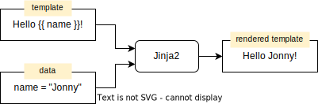

 
<link rel="stylesheet" href="../assets/css/styles.css">

[jinja2-home]: https://jinja.palletsprojects.com/
[jinja2-docs-lang]: https://jinja.palletsprojects.com/en/3.1.x/templates/
[jinja2-ansible]: https://docs.ansible.com/ansible/latest/playbook_guide/playbooks_templating.html
[jinja2-flask]: https://flask.palletsprojects.com/en/2.2.x/templating/
[jinja2-django]: https://docs.djangoproject.com/en/4.1/topics/templates/


### Abstract

[Jinja2][jinja2-home] is one of the most popular templating engine in Python with a huge
scope of applications. It is used by [Ansible][jinja2-ansible] to automate your
infrastructure or by web development frameworks, such as [Flask][jinja2-flask]. But it
still can do more for us. As it turns out, the ability to automate the creation of
parametrized text files can solve a lot of our smaller daily chores: create a shell script
to do repeated tasks, create a report based on some data file or parametrized snippets for
documents. In this session we'll create a simple Python program which can merge Jinja
templates with some data provided in JSON or YAML format.


<div id="toc">

### Agenda

1. [Introduction](#introduction)
1. Part 1: [Simple Jinja2 examples](#simple-jinja2-examples)
1. Part 2: [Render Jinja2 from Python](#render-jinja2-from-python)
1. Part 3: [Generic Jinja2 pre-processor](#generic-jinja2-pre-processor)
1. Part 4: [Automation examples](#automation-examples)

</div>


# Introduction

(back to [ToC](#toc))

1. Jinja2 is a *template engine* meant to programmatically create some text based on input
   data.

   1. "*programmatically create*": create automatically by a program, as opposed to a
      human using an editor.

   1. "*some text*": any type of text output, e.g.: 

      -  **plain** text, e.g.: email
      -  **markup** text, e.g.: HTML, Markdown, etc...
      -  **documentation** in either plain- or markup text
      -  **program source code**, e.g.: bash script
      -  **configuration files**, e.g.: router, switch, Bind zone files, Docker compose
         files, Kubernetes manifests, etc...

   1. "*based on input data*": data that is available at **run-time**, e.g.:

      -  registration data from a web form
      -  dump from an Excel sheet or a database table in CSV
      -  table-like data (CSV), containing sales records, hostnames, users, etc..
      -  hierarchical data (JSON, YAML), containing dates, accounts, etc...

1. A template engine is somewhat similar to a compiler in that it takes source code as
   input and based on instructions in the code transforms it into a modified output.
   
   There are also significant **differences** as well: a template engine will ignore
   everything in the input, except the specific and recognizable tokens meant for the
   engine.

   Example Jinja2 template:

   ~~~jinja2
   Hello {{name}}!
   ~~~

   Output, if `name="Jonny"`:

   ~~~
   Hello Jonny!
   ~~~

   


1. Jinja2 has its own (simplified) programming language. 

1. Jinja2 is frequently used for building web applications, mostly in one of the Python
   based development frameworks such as [Flask][jinja2-flask] or [Django][jinja2-django].

   Another well-known project is [Ansible][jinja2-ansible], which is using Jinja2 to render
   (configuration) files and playbooks.


# Simple Jinja2 examples

(back to [ToC](#toc))

This sessions focuses on using Jinja2 for practical purposes, not on learning the Jinja2
templating language. The [Template Designer Documentation][jinja2-docs-lang] is an
excellent resource to learn more about that.

The following examples are meant to illustrate the basics. The required data is assumed to
be loaded from the [`names.json`](../session02/names.json) file.

~~~json
{
  "kids": {
    "Chris": "Family Guy",
    "Pebbles": "The Flintstones",
    "Bart": "The Simpsons"
  },
  "adults": {
    "Fred": "The Flintstones",
    "Betty": "The Flintstones",
    "Homer": "The Simpsons",
    "Lois": "Family Guy"
  },
  "other": {
    "Klaus": "American Dad",
    "Brian": "Family Guy",
    "Roger": "American Dad"
  }
}
~~~

## Template

1. Refer to "Bart" in the show "The Simpsons":

   ~~~jinja2
   Bart is one of the kids in the show {{ kids['Bart'] }}.
   ~~~

   Will render the above Jinja2 template as:

   ~~~
   Bart is one of the kids in the show The Simpsons.
   ~~~

1. Refer to **non-existing** element:

   ~~~jinja2
   Lisa is Bart's sister in the show {{ kids['Lisa'] }}.
   ~~~

   Will trigger an **error**:

   ~~~
   ERROR: UndefinedError: template variable 'dict object' has no attribute 'Lisa'
   ~~~

1. Prevent an error in case referring to a non-existing element:

   ~~~jinja2
   Lisa is Bart's sister in {{ kids['Lisa'] | default('a show') }}.
   ~~~

   Will **not** trigger any error, because a default value has been provided:

   ~~~
   Lisa is Bart's sister in a show.
   ~~~

1. Using comments in Jinja2 templates:

   ~~~jinja2
   {#- Jinja2 comments start and end with the \{# and \#} markers  #}
   Lisa is Bart's sister in {{ kids['Lisa'] | default('a show') }}.
   ~~~

   Similar to the previous example; notice how the comment is not showing at all:

   ~~~
   Lisa is Bart's sister in a show.
   ~~~
   
   

1. Iterate through the group `kids`:

   ~~~jinja2
   The list of kids and the show they appear:
   
   - {{ character }} appears in the show {{ kids[character] }}.
   
   ~~~

   Is rendered as (note the empty lines!):

   ~~~

   The list of kids and the show they appear:

   - Chris appears in the show "Family Guy".

   - Pebbles appears in the show "The Flintstones".

   - Bart appears in the show "The Simpsons".
   ~~~

1. Same as the previous example, except manage the empty lines:

   ~~~jinja2
   The list of kids and the show they appear:
   
   - {{ character }} appears in the show "{{ kids[character] }}".
   
   ~~~

   The added dash (`-`) character (e.g.: `{%-` in lines 2 and 4) will remove **all**
   preceding *white space*, e.g. the empty line where the Jinja2 code stands:

   ~~~
   The list of kids and the show they appear:
   - Chris appears in the show "Family Guy".
   - Pebbles appears in the show "The Flintstones".
   - Bart appears in the show "The Simpsons".
   ~~~


# Render Jinja2 from Python

(back to [ToC](#toc))

1. Basic usage of Jinja2 in Python

   ~~~python
   # this file: j2_01.py

   import jinja2 as j2     # load Jinja2 module, refer to its content as "j2.*"

   template = '''
   The list of kids and the show they appear:
   
   - {{ character }} appears in the show "{{ kids[character] }}".
   
   '''.strip()                         # remove newlines from begin and end

   data = {                            # the data
       "Chris": "Family Guy",
       "Pebbles": "The Flintstones",
       "Bart": "The Simpsons"
   }

   j2_tmpl = j2.Template(template)     # create a new template object
   out = j2_tmpl.render(kids=data)     # render template with give data
   print(out)                          # print the rendered text
   ~~~

   **NOTE**:

   1. **line 3**: will load the Jinja2 module, but instead of the `Jinja2`, we can
      use the more convenient `j2` prefix.

   1. **lines 5 - 10**: the definition of the template text

   1. **line 10**: The `.strip()` string method will remove the *newline* characters that
      are embedded in the begin and end of the template string. These newlines are
      introduced by the `'''\n` (line 5) and `%}\n` (line 9).

   1. **lines 12 - 16**: Define the data. Jinja2 is capable of handling **much** more data
      than in used in this example.

   1. **line 18**: Create a new instance of the `Template` class.

   1. **line 19**: 
   
      1. Make the content of the `data` Python variable (a `dict` object) available as
         `kids` Jinja2 variable
         
         **NOTE**: Jinja2 is **very** strict in separating the scopes of the Python
         program and that of the template.

      1. render the tempate.
      1. Assign the rendered `str` object to the (Python) variable `out`

   1. **line 20**: Print out the rendered text.

   The program output:

   ~~~
   $ python3 j2_01.py
   The list of kids and the show they appear:
   - Chris appears in the show Family Guy.
   - Pebbles appears in the show The Flintstones.
   - Bart appears in the show The Simpsons.
   ~~~

2. Load both the template and the data from a file:

   This example combines:
   
   1. the basic Jinja2 example above, and
   1. working with data files from [Session 2](../session02/)

   ~~~python
   # this file: j2_02.py

   '''Render a Jinja2 template based on data

   Usage:
           python3 j2_02.py TEMPLATEFILE DATAFILE

   Where:
   TEMPLATEFILE: path to the text file containing a valid Jinja2 teamplte
   DATAFILE    : path to a JSON file containing the data
   '''

   import json
   import sys
   import jinja2 as j2     # load Jinja2 module, refer to its content as "j2.*"

   TEMPLATE = open(sys.argv[1]).read()    # load template from file given as
                                          # 1st CLI argument
   TEMPLATE = TEMPLATE.strip()            # remove newlines from begin and end

   DATA = json.load(open(sys.argv[2]))    # load data from file given as
                                          # 2nd CLI argument

   j2_tmpl = j2.Template(TEMPLATE)        # new Jinja2 template instance
   out = j2_tmpl.render(**DATA)           # pass unpacked data (assuming dict)
   print(out)
   ~~~

   **NOTE**:

   1. **lines 13 and 14**: load the required modules:

      -  `sys`: in order to access the CLI arguments
      -  `json`: in order to load a JSON file

   1. **line 17**: will execute the following steps:

      1. open the file referred to by the 1st CLI argument
      1. read its content as `str`
      1. assign the content to the variable `TEMPLTE`

   1. **line 19**: remove all leading- and trailing white space, i.e.: space, tab and
      newline characters.

   1. **line 21**: will:
   
      1.  open the data file referred to by the 2nd CLI argument
      1.  load its content and interpret it as JSON data

   1. **line 25**: the `**DATA` assumes that the loaded data is a `dict` (as opposed to a
      `list`) and unpacks its content as keyword arguments. In the template scope this
      will result in the following variables:

      ~~~jinja2
      kids = { "Chris": "Family Guy",
               "Pebbles": "The Flintstones",
               "Bart": "The Simpsons" }
      
      adults = { "Fred": "The Flintstones",
                 "Betty": "The Flintstones",
                 "Homer": "The Simpsons",
                 "Lois": "Family Guy" }
      
      other = { "Klaus": "American Dad",
                "Brian": "Family Guy",
                "Roger": "American Dad" }
      ~~~


   Given the following content of the file `kids.j2`:

   ~~~jinja2
   The list of kids and the show they appear:
   
   - {{ character }} appears in the show "{{ kids[character] }}".
   
   ~~~

   The program output:
   
   ~~~bash
   $ python3 j2_02.py kids.j2  ../session02/names.json  
   The list of kids and the show they appear:
   - Chris appears in the show "Family Guy".
   - Pebbles appears in the show "The Flintstones".
   - Bart appears in the show "The Simpsons".
   ~~~

# Generic Jinja2 pre-processor

(back to [ToC](#toc))

Based on the concepts demonstrate in the previous part, the program [j2pp.py](j2pp.py) has
been created. Its purpose is to render a Jinja2 template with the provided data.

## Example 1: Usage

~~~bash
$ ./j2pp.py --help
usage: j2pp.py [-h] [-D] [-d DATA_FILE] [-p [name=value [name=value ...]]]
               [-T TEMPLATE_DIRS [TEMPLATE_DIRS ...]] [-o OUTPUT]
               [template]

Jinja2 pre-processor

Render a Jinja2 template using data provided in a JSON, YAML or CSV file and
in the CLI arguments.

positional arguments:
  template              Template file (default: STDIN)

optional arguments:
  -h, --help            show this help message and exit
  -D, --debug           Dump the data that would be passed to the template
  -d DATA_FILE, --data-file DATA_FILE
                        file containing the data, will be passed to template
                        as variable "data"
  -p [name=value [name=value ...]], --params [name=value [name=value ...]]
                        additional parameters, will be passed to template as
                        variable "params", in the form of a dict
  -T TEMPLATE_DIRS [TEMPLATE_DIRS ...], --template-dirs TEMPLATE_DIRS [TEMPLATE_DIRS ...]
                        Template directories (default: the value of env.
                        variable "J2PP_PATH" or "."; now: ['.'])
  -o OUTPUT, --output OUTPUT
                        Write the output to this file (default: STDOUT)
~~~

## Example 2: Render a simple template with data provided on the CLI

~~~bash
$ echo -en 'Hello {{ name }}!\n\n' | ./j2pp.py --param name=Jonny
Hello Jonny!
~~~

## Example 3: error handling


The syntax of Jinja2 templates is sometimes complicated. A few examples to show how
`j2pp.py` handles different errors:


1. Undefined template variable name:

   ~~~bash
   $ echo -en 'Hello {{ name }}!\n\n' | ./j2pp.py --param f_name=Jonny
   *** Template ERROR: 'name' is undefined
   ~~~

1. Jinja2 syntax error in template:

   ~~~bash
   # Superfluous semicolon (;)
   $ echo -en 'Hello {{ name; }}!\n\n' | ./j2pp.py --param name=Jonny
   *** Template ERROR: expected token 'end of print statement', got ';'

   # Missing closing accolade (})
   $ echo -en 'Hello {{ name }!\n\n' | ./j2pp.py --param name=Jonny
   *** Template ERROR: unexpected '}'
   ~~~

1. Invalid YAML data format:

   ~~~bash
   $ ./j2pp.py --data  names_invalid.yaml  kids.j2 
   expected '<document start>', but found '<block mapping start>'
     in "<unicode string>", line 6, column 1:
       kids:
       ^
   File "names.yaml" could not be loaded
   ~~~
   

## Example 4: template and data both from a file

~~~bash
$ ./j2pp.py --data ../session02/names.json  kids.j2 
The list of kids and the show they appear:
- Chris appears in the show "Family Guy".
- Pebbles appears in the show "The Flintstones".
- Bart appears in the show "The Simpsons".
~~~

`j2pp.py` automatically recognizes the supported data formats based on the file's
extension. The same data from a YAML file:

~~~yaml
adults:
  Betty: The Flintstones
  Fred: The Flintstones
  Homer: The Simpsons
  Lois: Family Guy
kids:
  Bart: The Simpsons
  Chris: Family Guy
  Pebbles: The Flintstones
other:
  Brian: Family Guy
  Klaus: American Dad
  Roger: American Dad
~~~

~~~bash
$ ./j2pp.py --data ../session02/names.yaml kids.j2
The list of kids and the show they appear:
- Bart appears in the show "The Simpsons".
- Chris appears in the show "Family Guy".
- Pebbles appears in the show "The Flintstones".
~~~


## Example 5: dump the data

To verify what data is passed to Jinja use the `--debug` flag:

~~~bash
$ ./j2pp.py --data ../session02/names.yaml kids.j2 --debug
{'adults': {'Betty': 'The Flintstones',
            'Fred': 'The Flintstones',
            'Homer': 'The Simpsons',
            'Lois': 'Family Guy'},
 'data': {'adults': {'Betty': 'The Flintstones',
                     'Fred': 'The Flintstones',
                     'Homer': 'The Simpsons',
                     'Lois': 'Family Guy'},
          'kids': {'Bart': 'The Simpsons',
                   'Chris': 'Family Guy',
                   'Pebbles': 'The Flintstones'},
          'other': {'Brian': 'Family Guy',
                    'Klaus': 'American Dad',
                    'Roger': 'American Dad'}},
 'data_file': PosixPath('../session02/names.yaml'),
 'debug': True,
 'kids': {'Bart': 'The Simpsons',
          'Chris': 'Family Guy',
          'Pebbles': 'The Flintstones'},
 'now': datetime.datetime(2022, 12, 13, 12, 30, 18, 578173),
 'other': {'Brian': 'Family Guy',
           'Klaus': 'American Dad',
           'Roger': 'American Dad'},
 'output': <_io.TextIOWrapper name='<stdout>' mode='w' encoding='UTF-8'>,
 'params': None,
 'template': PosixPath('kids.j2'),
 'template_dirs': ['.']}
~~~

# Automation examples

(back to [ToC](#toc))

Ansible's templating module uses Jinja2 as well, so the following examples may seem very
familiar.

## Bash script

### Use case

Create a system administration script to automate some tasks, in this case: create users.

### Inputs

1. [JSON file](../session02/names.json) containing users and group information

1. [Jijna2 template](demo_bash.sh.j2) to create the users

   ~~~jinja2
   # Script to create users from data file
   
   # Create the groups
   
   groupadd {{ grp }}
   
   
   # Create the users
   
   ## Creating the users of the group '{{ grp }}':
   
   useradd -g {{ grp }} -c '{{ data[grp][user] }}' {{ user | lower }}
   
   
   ~~~
   


### Generate bash script

~~~bash
$ ./j2pp.py  --data ../session02/names.json  demo_bash.sh.j2

# Script to create users from data file

# Create the groups
groupadd kids
groupadd adults
groupadd other

# Create the users

## Creating the users of the group 'kids':
useradd -g kids -c 'Family Guy' chris
useradd -g kids -c 'The Flintstones' pebbles
useradd -g kids -c 'The Simpsons' bart

## Creating the users of the group 'adults':
useradd -g adults -c 'The Flintstones' fred
useradd -g adults -c 'The Flintstones' betty
useradd -g adults -c 'The Simpsons' homer
useradd -g adults -c 'Family Guy' lois

## Creating the users of the group 'other':
useradd -g other -c 'American Dad' klaus
useradd -g other -c 'Family Guy' brian
useradd -g other -c 'American Dad' roger
~~~


## Create importable bookmarks

### Use case

An easy way to exchange bookmarks between different computers / user accounts.

### Inputs

1. A [data file](demo_bookmarks_data.yaml) containing the bookmark information, e.g.:

   ~~~yaml
   bookmarks:
     - title: ":wave: Music page 1"
       url: https://mydomain.nl/music/1
       tags: [ music, tag 1, tag 3 ]
       shortcut: page1
       icon_uri: https://www.defluit.nl/
     - title: Music page 2
       url: https://mydomain.nl/music/2
     - title: Music page 3
       url: https://mydomain.nl/music/3
     - title: Music page 4
       url: https://mydomain.nl/music/4
     - title: Music page 5
       url: https://mydomain.nl/music/5
     - title: Music page 6
       url: https://mydomain.nl/music/6
     - foldername: Test folder
       content:
       - title: Test page 5
         url: https://mydomain.nl/Test/5
       - title: Test page 6
         url: https://mydomain.nl/Test/6
       - foldername: Sub-sub folder
         content:
         - title: Bla!
           url: https://nu.nl
     - title: Music page 7
       url: https://mydomain.nl/music/7
   ~~~
   
1. [Jijna2 template](demo_bookmarks.html.j2) containing the logic and syntax to generate
   an HTML file that can be imported by both Firefox and Chrome as a bookmark collection.

   ~~~jinja2
   <!--
   Usage: 
     - Create importable bookmarks for Firefox,
       with additional bookmark attributes:
          
       ./j2pp.py --param firefox=1 title='Demo bookmarks' \
                 --data demo_bookmarks_data.yaml \
                 demo_bookmarks.html.j2
   
     - Create importable bookmarks for Chrome/Chromium:
   
       ./j2pp.py --param firefox=0 title='Demo bookmarks' \
                 --data demo_bookmarks_data.yaml \
                 demo_bookmarks.html.j2
   -->
   ...
   ~~~

### Generate docs

~~~bash
./j2pp.py --param firefox=1 title='Demo bookmarks' \
          --data demo_bookmarks_data.yaml \
          demo_bookmarks.html.j2
~~~

An example importable bookmark HTML is in file [demo_bookmarks.html](demo_bookmarks.html).


## Other possible examples

-  Create a Bind zone file
-  Automate the management of VLANs
-  etc...


## Create parametrized documentation


### Use case

Create documentation (installation or administration instructions) that contains the
specific settings but is reusable for different environments.


### Inputs

1. Documentation as markup text (e.g.: [Markdown](https://www.markdownguide.org/),
   [ReStructuredText](https://www.sphinx-doc.org/en/master/usage/restructuredtext/basics.html),
   [AsciiDoc](https://asciidoc.org/) or perhaps
   [MediaWiki](https://meta.wikimedia.org/wiki/Help:Wikitext_examples))

   This is a Markdown template:

   ~~~jinja2
   {#- this file: demo_doc.j2             -#}
   
   
   # Instruction start the webserver
   
   1. Log in to `{{ env.fqdn_web }}` as user `{{ env.admin }}`.
   
   1. Execute the following:
   
      ```bash
      systemctl start {{ env.svc_web }}
      ```
   
   date last update: {{ now.strftime('%Y-%m-%d') }}
   ~~~
   
1. JSON, YAML or CSV file with the parameters

   In this case the following YAML file:

   ~~~yaml
   # this file: demo_doc_data.yaml
   environments:
     prd:
       fqdn_web: webprd32.prd.example.com
       admin: webmaster
       svc_web: httpd
     tst:
       fqdn_web: web2.tst.example.com
       admin: admin
       svc_web: httpd
   ~~~
   
### Generate docs

1. For `prd` environment:

   ~~~bash
   j2pp.py -d demo_doc_data.yaml -p envname=prd demo_doc.j2
   ~~~

   The output:

   ~~~markdown
   # Instruction start the webserver

   1. Log in to `webprd32.prd.example.com` as user `webmaster`.

   1. Execute the following:

      ```bash
      systemctl start httpd
      ```

   date last update: 2022-12-13
   ~~~
      
1. For `tst` environment:

   ~~~markdown
   # Instruction start the webserver
   
   1. Log in to `web2.tst.example.com` as user `admin`.
   
   1. Execute the following:
   
      ```bash
      systemctl start httpd
      ```
   
   
   date last update: 2022-12-13
   ~~~
   

<script src="../assets/js/script.js" defer></script>

<!--
vim: filetype=markdown spelllang=en,nl spell foldmethod=marker lbr nolist ruler
vim: tw=90 wrap showbreak=… shiftwidth=3 tabstop=3 softtabstop=3 expandtab
-->

