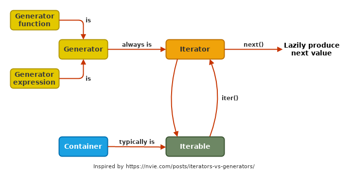

.. Fancy RST roles, needs rst2html-fancy.css

.. role:: tst
   :class: test
.. role:: file(code)
.. role:: dir(code)
.. role:: key(code)
.. role:: cmd(code)
.. role:: url(code)

.. role:: var(code)
.. role:: type(code)
.. role:: func(code)
.. role:: class(code)
.. role:: mod(code)

.. role:: git(code)
.. role:: commit(code)
.. role:: tag(code)
.. role:: bug(code)

.. role:: app(code)
.. role:: user(code)
.. role:: dottedline(code)
.. role:: verticalspace(code)

.. Abbreviations
.. =============

.. |ANSWER| replace:: **Answer/Solution:**

.. |GIT| replace:: :app:`Git`
.. |PYTHON| replace:: :app:`Python`

.. |DOTTEDLINE| replace:: :dottedline:`✎`

================================================================================
Working with Data Part 3: The Iterator Protocol and its Uses
================================================================================

--------------------------------------------------------------------------------
Python Tuesday: Session 7
--------------------------------------------------------------------------------

:date: 2020-05-26
:author: Gábor Nyers
:tags: python
:category: python_workshop
:summary: The Iterator protocol and its practical uses
:licence: CC BY-NC 4.0 https://creativecommons.org/licenses/by-nc/4.0/

.. sectnum::
   :start: 1
   :suffix: .
   :depth: 2

.. contents:: Contents:
   :depth: 2
   :backlinks: entry
   :local:

Abstract
================================================================================

The next Python Tuesday session is all about how iterators help us to solve
many data-processing related problems. The term 'iterator' may sound abstract
but there is a practical benefit and they everywhere in Python3. For example
the functions like sum(), min(), max() or the much more powerful sorted(),
filter() and map() functions.

Agenda
================================================================================

- Introduction (what is the "Iterator Protocol" and  do we care?)
- A bit of theory: Concepts
- Tools and data types
- Use cases

Introduction
================================================================================

- As a Python programmer you rely on the Iterator protocol every time that
  you:

  - process the elements of a container data type in a :code:`for` loop, e.g.:
    :type:`list`, :type:`dict`
  - sort the elements of a container data type
  - use any of the following functions: :func:`min()`, :func:`max()`,
    :func:`sum()`, :func:`map()`, :func:`sorted()`, :func:`filter()`

- The working of the above facilities is possible because the involved
  components work in concert according the "Itereator Protocol"

A bit of theory: Concepts
================================================================================

What is the problem that is being solved here?
----------------------------------------------

- **Fundamental task**: process **every element** of a container, e.g.: ::

   >>> s = 'Beautiful is better than ugly.'     # str, with 30 elements

   >>> l = [ 1, 2, 92, -32, 'python', 3.1415 ]  # list, 6 elements of 3 types

   >>> t = ( 3, 9, 'cheese shop', False )       # tuple

   >>> d = { 'alice': 32, 'bob': 42 }           # dict

   >>> s = { 3, 3, 3, 4, -1, True, 94 }         # set

   >>> b = b'\xe2\x82\xac1 = \xc6\x922.20'      # bytes ('€1 = ƒ2.20')

   >>> ab = Addressbook( Person('Alice'), \     # an custom `Addressbook`
   ...                   Person('Bob'),   \     # class, containing
   ...                   Person('Carol') )      # a collection of `Persons`

- **Challenges**:

  - The internal implementations of these data structures are different. **HOW
    TO** make sure that we can loop through all of them?

  - New collection classes will have yet different implementation. **HOW TO**
    make sure that existing code can work with these new data types?

  - |Python| is a high-level programming language, **HOW TO** make sure that
    there is a uniform and simple way to loop through these collections,
    without a lot of "boilerplate code".

- **Solution**: The "Iterator Protocol", i.e.: a few simple rules that govern
  the "conversation" between components to get all elements of a collection.

  Example: the code :code:`for e in [1,2,3,4]: print(e)` involves the
  concerted "effort" of 3 different parties:

  - the :code:`for` loop,
  - an (implicit) "Iterator", and
  - the "Iterable" (of :type:`list`)

The Iterator Protocol
---------------------

A general concept implemented in many modern programming languages. The most
fundamental steps:

1. Each container data type (the *Iterable*, e.g. :type:`list`
   :code:`[1,2,3,4]`) must implement its own "Iterator", which can retrieve
   all elements of the *Iterable* object

2. The *Iterator* must be produced upon "request", i.e. in Python the return
   value of the :func:`iter()` function: ::

    >>> myiterator = iter([1,2,3,4])

3. The component (e.g. :code:`for` loop), which wants to access the elements
   of the *Iterable* (:code:`[1,2,3,4]`) will use the *Iterator*
   (:code:`myiterator`) to access the elements. In |Python| the component will
   invoke the :func:`next()` function to receive the next unseen element: ::

    >>> next_elem = next(myiterator)

4. The component will repeat the :func:`next()` call, until the *Iterator*
   (:code:`myiterator`) signals that there is no element left. In |Python|
   this signalling occurs by the *iterator* raising the :code:`StopIteration`
   exception: ::

    >>> next(myiterator)
    2                                       # the next element
    >>> next(myiterator)
    3                                       # the next element
    >>> next(myiterator)
    4                                       # the next and last(!) element
    >>> next(myiterator)                    # nothing more left!
    Traceback (most recent call last):
      File "<stdin>", line 1, in <module>
    StopIteration

See also: `Python 3 documentation on an Iterator <https://docs.python.org/3/glossary.html#term-iterator>`_

Iterator Examples
-----------------

- manually driving the loop, the programmer walks through the elements of
  the :code:`str` *Iterable* using a :code:`str_iterator` *Iterator*: ::

    >>> s = 'Beautiful is better than ugly.'     # Iterable: str
    >>> str_i = iter(s)                          # Iterator: str_i
    >>> type(str_i)
    <class 'str_iterator'>
    >>> next(str_i)                              # "Next element, please!"
    'B'
    >>> next(str_i)
    'e'
    >>> next(str_i)                              # ... repeat until done.
    'a'

- :code:`list` *Iterable* provides the :code:`list_iterator` *Iterator* to
  loop through the content one :func:`next()` call at a time: ::

    >>> l = [ 1, 2, 92, -32, 'python', 3.1415 ]
    >>> myiterator_l = iter(l)
    >>> type(myiterator_l)
    <class 'list_iterator'>                      # an iterator specific
                                                 # for the `list` data type
    >>> next(myiterator_l)                       # same behavior
    1

- the :func:`sum()` function drives an implicit loop to sum up the
  :type:`dict` object's keys using a :code:`dict_keyiterator` *Iterator*: ::

    >>> sum({ 3: 'three', 1: 'one', 10: 'ten'})
    14
    >>> iter({ 3: 'three', 1: 'one', 10: 'ten'})
    <dict_keyiterator object at 0x7f69e460af48>

    >>> s = { 3, 3, 3, 4, -1, True, 94 }         # set

- the :func:`min()` function drives an implicit loop to find the minimal value
  of the :type:`set` object using a  : ::

    >>> s = set('Python')                       # convert a `str` to `set`
    >>> s
    {'t', 'n', 'o', 'h', 'P', 'y'}              # can you guess why scrambled?
    >>> min(s)                                  # give me the "smallest" element
    'P'
    >>> type( iter( {'t', 'n', 'o', 'h', 'P', 'y'} ) )
    <class 'set_iterator'>

- in |Python| the :func:`iter()` function calls the *Iterable*'s
  :func:`.__iter__()` method to get the *Iterator* object: ::

   >>> t = (1,2,3,4)
   >>> tuple_i = t.__iter__()
   >>> type(tuple_i)
   <class 'tuple_iterator'>
   >>> next(tuple_i)
   1
   >>> next(tuple_i)
   2

- the **same** *Iterable* can be looped through using multiple *Iterators* at
  the **same** time.
  Each *Iterator* stores its own position independently so they do not
  interfere with each other: ::

   >>> s = 'Explicit is better than implicit.'    # str Iterable
   >>> str_i1 = iter(s)                           # 1st Iterator
   >>> str_i2 = iter(s)                           # 2nd Iterator
   >>> str_i1, str_i2
   (<str_iterator object at 0x7f69e460ce80>, 
    <str_iterator object at 0x7f69e460cf28>)
   >>> next(str_i2)                               # 2nd Iterator first
   'E'
   >>> next(str_i2)                               # str_i2 gives 2nd element
   'x'
   >>> next(str_i1)                               # str_i1: 1st element
   'E'
   >>> next(str_i2)                               # we switch arbitralily
   'p'
   >>> next(str_i1)                               # the Iterators keep track
   'x'                                            # of their position
   >>> next(str_i1)
   'p'
   >>> next(str_i1)
   'l'
   >>> next(str_i2)
   'l'

Generators
----------

A *Generator*:

- represents a collection of objects, which are (usually) not in the |Python|
  process' memory, but are generated with an expression or function.

  **Example**: the numerical sequence of the `Fibonacci numbers
  <https://www.mathsisfun.com/numbers/fibonacci-sequence.html>`_ (the "hello
  world" of generator examples ;-)

  This is an collection of :type:`int` objects, which can be generated using
  an expression: :code:`f_next = f_last + f_2ndlast`

- is an *Iterator*, i.e.: upon request of the :func:`next()` it will produce
  the next element.

Generator Examples
------------------

Generators can be created by either
- a generator function, or
- a generator expression

**Generator function**: any function with the :code:`yield` keyword in it: ::

 >>> def fibonacci(n):               # doctest: +ELLIPSIS
 ...     a, b = 0, 1
 ...     i = 0
 ...     while i < n:
 ...         yield b
 ...         a, b  = b, a+b
 ...         i += 1

 >>> g = fibonacci(12)               # generator is create, but not started

 >>> type(g)
 <class 'generator'>

 >>> next(g)                         # produce the next value()
 1

 >>> g.__next__()                    # next() invokes the .__next__()
 1                                   # magic method of the generator

 >>> next(g)
 3

 >>> list(fibonacci(12))             # force the generator to produce
 [1, 1, 2, 3, 5, 8, 13, 21, 34, 55, 89, 144]

**A generator expression**: similar syntax as any comprehension, but with
round braces: :code:`(` :code:`)`::

 >>> l = [3, 4, 5, 6, 7, 11]           # some data

 >>> g = ( e**2  for e in l )          # a generator expression

 >>> type(g)
 <class 'generator'>

 >>> next(g)                           # like any other Iterator...
 9
 >>> next(g)
 16
 >>> next(g)
 25

Summary of Iterator/Generator Concepts
--------------------------------------------------------------------------------

A nice summary of the above concepts (inspired by `this article
<https://nvie.com/posts/iterators-vs-generators/>`_)

Related Tools and Data Types
================================================================================

Keywords
--------------------------------------------------------------------------------

- keyword :code:`for`: can loop through the elements of **any** *Iterable*
- operator :code:`in`: checks if an object is an element of a collection

Data types
--------------------------------------------------------------------------------

- :type:`str`, :type:`list`, :type:`tuple`, :type:`bytes` (sequence types)
  etc...
- :type:`dict`, :type:`set` (mapping types)
- :type:`file`, i.e.: the return value of :func:`open()`
- custom classes, which implement the :func:`.__iter__()` method

Functions
--------------------------------------------------------------------------------

- :func:`sorted()`: sort an *Interable*, optionally with a specific sorting
  function
- :func:`reversed()`: reverse the order of the elements of an *Iterable*
- :func:`min()`, :code:`max()`: return the minimal or maximal value of
- :func:`filter()`
- :func:`map()`
- :func:`itemgetter()`: ::

    from operator import itemgetter
    firstelem = itemgetter(0)
    l = [ [a,b,c] for a in 'abc' for b in '12345' for c in 'ATGC' ]
    firstelems = map(firstelem; l)

- :func:`range()`: 
- :func:`enumerate()`:

Use cases
================================================================================

Sorting with a specific sorting function
--------------------------------------------------------------------------------

**Challenge**
   Sort a list with the days of the week (list of strings) in the correct
   order. ::

    >>> days = 'Mon Sun Tue Fri Sat Sun Mon Tue Mon Wed Sat Thu Fri'.split()
    >>> days
    ['Mon', 'Sun', 'Tue', 'Fri', 'Sat', 'Sun', 'Mon', 'Tue', 'Mon', 'Wed', 'Sat', 'Thu', 'Fri']

**Problem**
   By default :func:`sorted()` function will sort strings in alphabetical
   order (lexicographical order). ::

    >>> sorted(days)
    ['Fri', 'Fri', 'Mon', 'Mon', 'Mon', 'Sat', 'Sat', 'Sun', 'Sun', 'Thu', 'Tue', 'Tue', 'Wed']

**Solution**
   Use a sort function which will define the order of the elements: ::

    >>> def day_sorter(day):
    ...     # the desired order of the elements
    ...     order = 'Mon Tue Wed Thu Fri Sat Sun'.split()
    ...     # return the position of the current element in the `order` list
    ...     return order.index(day)
    ...
    >>> sorted(days, key=day_sorter)
    ['Mon', 'Mon', 'Mon', 'Tue', 'Tue', 'Wed', 'Thu', 'Fri', 'Fri', 'Sat', 'Sat', 'Sun', 'Sun']

**Bonus**
   The same sorting function will also work with :func:`min()` and :func:`max()` ::

    >>> min(days)
    Fri                                # No!
    >>> min(days, key=day_sorter)
    Mon                                # Yes!

Counting
--------------------------------------------------------------------------------

.. _dict_persons:

**Challenge**
   How many males and females are in the following :type:`dict`? ::

    persons = [
        {'name': 'Lucy',     'age': 14, 'gender': 'f'},
        {'name': 'Andrej',   'age': 34, 'gender': 'm'},
        {'name': 'Mark',     'age': 17, 'gender': 'm'},
        {'name': 'Thomas',   'age': 44, 'gender': 'm'},
        {'name': 'Evi',      'age': 25, 'gender': 'f'},
        {'name': 'Robert',   'age': 23, 'gender': 'm'},
        {'name': 'Dragomir', 'age': 54, 'gender': 'm'},
        {'name': 'Jenny',    'age': 34, 'gender': 'f'},
        {'name': 'Eline',    'age': 29, 'gender': 'f'},
    ]

**Solution**
   Count the number of values of the :code:`gender` attribute using the
   :type:`collections.Counter` class. **But**: :type:`Counter` needs the
   to be counted values in a sequence-like *Iterable*, e.g.: ::

    >>> from collections import Counter
    >>> Counter('abracadabra')
    Counter({'a': 5, 'b': 2, 'r': 2, 'c': 1, 'd': 1})

   .. _gender_data_iterator:

   **However** the data is in a :type:`dict`! So let's extract the required
   data with a small :code:`lambda` function: ::

    >>> gender_data_iterator = map(lambda v: v['gender'], persons)
    >>> Counter(gender_data_iterator)
    Counter({'m': 5, 'f': 4})

**Bonus**
   What if the data is not clean? ::

    persons2 = [
        {'name': 'Lucy',     'age': 14, 'gender': 'f'},
        {'name': 'Andrej',   'age': 34, 'gender': 'm'},
        {'name': 'Mark',     'age': 17, 'gender': 'M'},
        {'name': 'Thomas',   'age': 44, 'gender': 'M'},
        {'name': 'Evi',      'age': 25, 'gender': 'f'},
        {'name': 'Robert',   'age': 23, 'gender': 'M'},
        {'name': 'Dragomir', 'age': 54, 'gender': 'M'},
        {'name': 'Jenny',    'age': 34, 'gender': 'F'},
        {'name': 'Eline',    'age': 29, 'gender': 'F'},
    ]

   In this case the previous solution clearly would give the wrong answer: ::

    >>> Counter( map(lambda v: v['gender'], persons2) )
    Counter({'M': 4, 'F': 2, 'f': 1, 'm': 1, 'v': 1})

   So, let's lower-case the values before counting: 
   :code:`lambda v: v['gender'].lower()`: ::

    >>> gender_data_iterator2 = map(lambda v: v['gender'].lower(), persons2)
    >>> Counter(gender_data_iterator2)
    Counter({'m': 5, 'f': 4})

   To see how this works, let's examine just the :code:`lambda` function.

   The raw data record: ::
    >>> persons2[3]
    {'name': 'Thomas', 'age': 44, 'gender': 'M'}

   When we apply the :code:`lambda` function to the raw data: ::

    >>> f = lambda v: v['gender'].lower()
    >>> f(persons2[3])
    'm'

Categorizing
--------------------------------------------------------------------------------

**Problem**
   Given the :var:`persons` `(see) <dict_persons_>`_ :type:`dict` of the
   previous example, sort the persons into age groups of decades, that is:
   0-9, 10-19, 20-29, 30-39 etc...

**Analysis**
   Let's define the desired output of our program as a :type:`dict`, where:

   - the keys: are the age buckets, expressed by a :type:`range` object, e.g.:
     :code:`range(10)`. This corresponds with the ages of 0-9.
   - values: are :type:`list`, which contain the persons, who fall in the age
     bucket, e.g.: ::

      {
       range(10, 20): [{'name': 'Lucy', 'age': 14, 'gender': 'f'},
                       {'name': 'Mark', 'age': 17, 'gender': 'm'}],
       range(20, 30): [{'name': 'Evi', 'age': 25, 'gender': 'f'},
                       {'name': 'Robert', 'age': 23, 'gender': 'm'},
                       {'name': 'Eline', 'age': 29, 'gender': 'f'}],
       range(30, 40): [{'name': 'Andrej', 'age': 34, 'gender': 'm'},
                       {'name': 'Jenny', 'age': 34, 'gender': 'f'}]
      }

**Solution**
   We'll need a :type:`list` (or :type:`tuple`), which contains the different
   :type:`range` objects, against which the program will examine a person
   :type:`dict`, e.g.: ::

    categories = (range(9), range(10,20), range(20, 30), range(30, 40))

   Also needed is an empty :type:`dict`, which will store the result: ::

    res = {}

   Finally, a nested loop will walk through the :code:`persons` :type:`dict`
   and match the age of the current :code:`person` against each :type:`range`
   object: ::

    for r in categories:
        for p in persons:
            if p['age'] in r:
                res.setdefault(r, []).append(p)

   The line code:`res.setdefault(r, []).append(p)` is perhaps the most
   intriguing here. Let's break this down:

   - :code:`.setdefault()` method will return one of the following values:

     - the value of the key :code:`r` (i.e.: a :type:`list`), if :code:`r` is
       an existing key in :code:`res`, OR
     - add the key :code:`r` with an empty :type:`list` as value to
       :code:`res` AND return this empty :type:`list` object, if :code:`r` was
       not yet a key

   - in either of the above cases, the expression 
     :code:`res.setdefault(r, [])` will return a :type:`list`, to which we
     append the current person :type:`dict` as a new element.

**Bonus**
   This algorithm will accept any arbitrary age buckets, even if they overlap.
   Observe the extended :code:`categories`, where we added the age groups
   representing: elementary school children, high-school children, adults and
   retirees: ::

    categories = (range(9), range(10,20), range(20, 30), range(30, 40),
                  range(6, 15), range(15, 19), range(19, 67), range(67, 120))

    def categorize(persons, categories):
        res = {}

        for r in categories:
            for p in persons:
                if p['age'] in r:
                    res.setdefault(r, []).append(p)
        return res

    print(categorize(persons, categories))

   The result is: ::

    {range(10, 20): [{'name': 'Lucy', 'age': 14, 'gender': 'f'},
                     {'name': 'Mark', 'age': 17, 'gender': 'm'}],

     range(20, 30): [{'name': 'Evi', 'age': 25, 'gender': 'f'},
                     {'name': 'Robert', 'age': 23, 'gender': 'm'},
                     {'name': 'Eline', 'age': 29, 'gender': 'f'}],

     range(30, 40): [{'name': 'Andrej', 'age': 34, 'gender': 'm'},
                     {'name': 'Jenny', 'age': 34, 'gender': 'f'}],

     range( 6, 15): [{'name': 'Lucy', 'age': 14, 'gender': 'f'}],

     range(15, 19): [{'name': 'Mark', 'age': 17, 'gender': 'm'}],

     range(19, 67): [{'name': 'Andrej', 'age': 34, 'gender': 'm'},
                     {'name': 'Thomas', 'age': 44, 'gender': 'm'},
                     {'name': 'Evi', 'age': 25, 'gender': 'f'},
                     {'name': 'Robert', 'age': 23, 'gender': 'm'},
                     {'name': 'Dragomir', 'age': 54, 'gender': 'm'},
                     {'name': 'Jenny', 'age': 34, 'gender': 'f'},
                     {'name': 'Eline', 'age': 29, 'gender': 'f'}]
    }

Iterable Classes
--------------------------------------------------------------------------------

**Problem**
   Create the :type:`Addressbook` class, which is a collection of
   :type:`Person` instances. Make sure that the :type:`Addressbook` instances
   are *Iterable*.

**Solution**
   Let's use the recently introduced :mod:`dataclasses` module to create the
   classes. ::

    from dataclasses import dataclass, field
    from typing import List

    @dataclass
    class Person:
        fname: str = ''
        sname: str = ''
        gender: str = ''
        email: str = ''

    @dataclass
    class Addressbook:
        name: str = 'My Addressbook'
        _items: List[Person] = field(default_factory=list, init=False)

   At this point the :type:`Addressbook` instances can hold items, but it is
   not yet an *Iterable*: ::

    >>> ab = Addressbook()
    >>> ab
    Addressbook(name='My Addressbook', _items=[])
    >>> ab2._items += [ 'Jenny', 'Robert', 'Alice' ]
    >>> ab2
    Addressbook(name='My Addressbook', _items=['Jenny', 'Robert', 'Alice'])

   However it is not yet an *Iterable*: ::

    >>> list(ab2)
    Traceback (most recent call last):
      File "<stdin>", line 1, in <module>
    TypeError: 'Addressbook' object is not iterable

   In |Python| a class is only *Iterable* if it implements the
   :func:`.__iter__()` method, which provides an *Iterator* instance. So let's
   do it: ::

    @dataclass
    class Addressbook:
        name: str = 'My Addressbook'
        _items: List[Person] = field(default_factory=list, init=False)

        def __iter__(self):
            return iter(self._items)

   It is now working: ::

    >>> ab2 = Addressbook()
    >>> ab2._items += [ 'Jenny', 'Robert', 'Alice' ]
    >>> ab2
    Addressbook(name='My Addressbook', _items=['Jenny', 'Robert', 'Alice'])

    >>> list(ab2)                      # convert Addressbook -> list
    ['Jenny', 'Robert', 'Alice']

   While at it why don't we add a couple of other nice features, such as:

   - implement the :func:`.add()` method, which will add an item to the
     address book
   - implement the :func:`.__len__()` method, so that the :func:`len()`
     function is able to show the number of elements in the collection.

   ::

    @dataclass
    class Addressbook:
        name: str = 'My Addressbook'
        _items: List[Person] = field(default_factory=list, init=False)

        def __iter__(self):
            return iter(self._items)

        def add(self, person):
            self._items.append(person)

        def __len__(self):
            return len(self._items)

   Try out the result: ::

    >>> fred = Person(fname='Fred', sname='Flintstone', gender='m',
                  email='fred@bedrock.place')
    >>> wilma = Person(fname='Wilma', sname='Flintstone', gender='f',
                   email='wilma@bedrock.place')

    >>> ab = Addressbook(name='The Flintstones')
    >>> ab.add(fred)
    >>> ab.add(wilma)

    >>> print(f'Number of entries in addressbook: {len(ab)}')
    2

**Bonus**
   By implementing the :func:`.getitem()` magic method on the :type:`Person`
   class, we even can use the `previous solution <gender_data_iterator_>`_ to count: ::

    @dataclass
    class Person:
        fname: str = ''
        sname: str = ''
        gender: str = ''
        email: str = ''

        def __getitem__(self, item):
           res = getattr(self, item)
           return res

    @dataclass
    class Addressbook:
        name: str = 'My Addressbook'
        _items: List[Person] = field(default_factory=list, init=False)

        def __iter__(self):
            return iter(self._items)

        def add(self, person):
            self._items.append(person)

        def __len__(self):
            return len(self._items)

    fred = Person(fname='Fred', sname='Flintstone', gender='m',
              email='fred@bedrock.place')

    wilma = Person(fname='Wilma', sname='Flintstone', gender='f',
               email='wilma@bedrock.place')

    ab = Addressbook(name='The Flintstones')
    ab.add(fred)
    ab.add(wilma)

   Finally let's try how our new classes fit in our data-processing toolkit so
   far : ::

    gender_data_iterator = map(lambda v: v['gender'], ab)

    >>> Counter(gender_data_iterator)
    Counter({'m': 1, 'f': 1})

.. vim: filetype=rst textwidth=78 foldmethod=syntax foldcolumn=3 wrap
.. vim: linebreak ruler spell spelllang=en showbreak=… shiftwidth=3 tabstop=3
